# Problem 6: Real-time Scoreboard API — Visual Diagrams

This document provides detailed visual diagrams for the Real-time Scoreboard
API module. The full build specification lives in
[README.md](README.md); the deferred work, annotated code
samples, and open product questions live in
[IMPROVEMENTS.md](IMPROVEMENTS.md).

All diagrams use Mermaid in fenced ```` ```mermaid ```` blocks, which
GitHub renders inline. Pre-rendered SVGs of every diagram also live in
[diagrams/](diagrams/) for viewers that don't render Mermaid (Word, Slack
previews, exported PDFs); the `.mmd` source files sit next to them and
stay editable. If you are reading raw text and want a quick render, paste
any block into <https://mermaid.live>. ASCII alternatives are included
where they aid skimming.

To regenerate the SVGs after editing a `.mmd` file (or a Mermaid block in
this README), run from the repo root:

```bash
for f in src/problem6/diagrams/*.mmd; do
    npx mmdc -i "$f" -o "${f%.mmd}.svg"
done
```

---

## 1. System context

Where the module sits relative to the browser, the data stores, and other
instances of itself. REST and WebSocket are served by the same Node process
in v1; they can split into separate gateways later without changing the
wire protocol.

### 1.1 Mermaid view

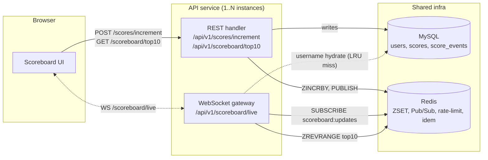


### 1.2 ASCII view

```text
┌─────────────┐
│   Clients   │
│ (Browser /  │
│  Mobile)    │
└──────┬──────┘
       │ HTTPS / WSS
       ▼
┌────────────────────────────────────────┐
│   Load Balancer / API Gateway          │
│   - TLS, per-IP rate-limit             │
└──────────┬─────────────────────────────┘
           │
   ┌───────┴────────┐
   ▼                ▼
┌──────────┐   ┌──────────┐
│ Instance │   │ Instance │   (Scaled horizontally)
│  REST+WS │   │  REST+WS │
└────┬─────┘   └────┬─────┘
     └────────┬──────┘
              │
      ┌───────┴───────┐
      ▼               ▼
 ┌─────────┐    ┌──────────────┐
 │  MySQL  │    │    Redis     │
 │ (truth) │    │ ZSET, PubSub │
 └─────────┘    └──────────────┘
```

---

## 2. Score increment — happy path (sequence)

End-to-end flow from a completed user action to every connected client
seeing the updated board. The dashed arrow at the bottom shows the
broadcast fan-out: one write triggers an update to every subscribed socket
on every gateway instance.

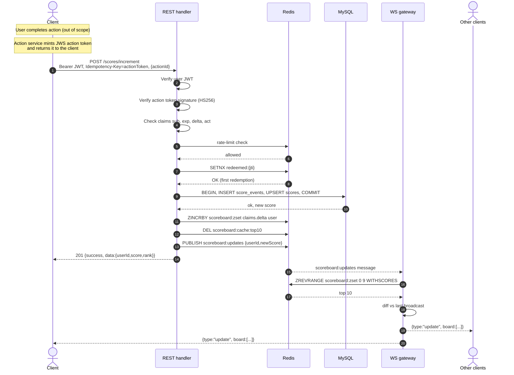

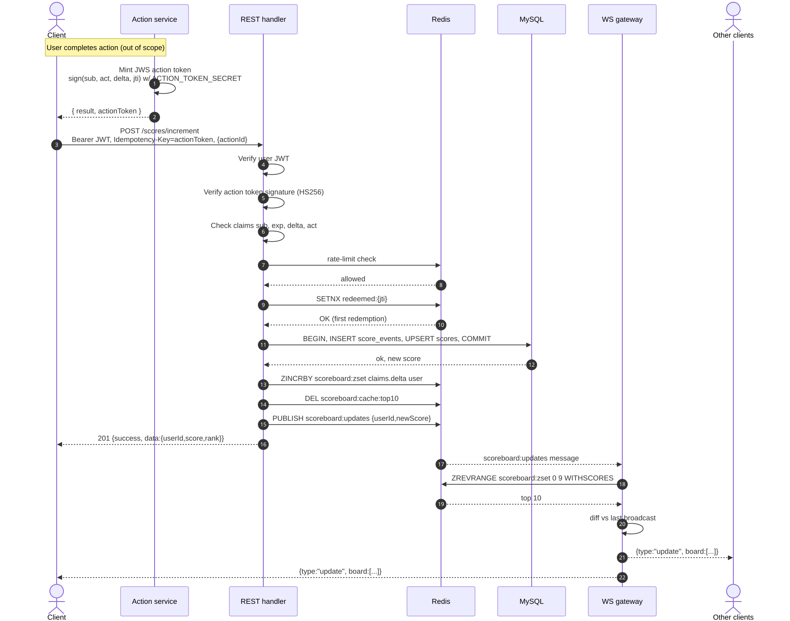

### 2.1 Step-by-step narrative

| # | Component | Action |
| --- | --- | --- |
| 0 | Action service (out of scope) | Mints a JWS action token (`sub`, `act`, `delta`, `jti`) signed with `ACTION_TOKEN_SECRET`, returns to client |
| 1 | Client | `POST /scores/increment` with user JWT + `Idempotency-Key: <action token>` |
| 2 | REST | Verify user JWT signature + expiry |
| 3 | REST | Verify action token signature (HS256, `ACTION_TOKEN_SECRET`) |
| 4 | REST | Check claims: `sub` matches user, `exp` (if present) > now, `1 ≤ delta ≤ MAX`, `act` matches body `actionId` if any |
| 5 | Redis | Token-bucket rate limit on `ratelimit:user:{u}` |
| 6 | Redis | `SETNX redeemed:{jti}` — single-use redemption check |
| 7 | MySQL | TX: `INSERT score_events` (storing `jti` as idempotency_key), `UPSERT scores`, `COMMIT` |
| 8 | Redis | `ZINCRBY scoreboard:zset <claims.delta> <user>` |
| 9 | Redis | `DEL scoreboard:cache:top10` |
| 10 | Redis | `PUBLISH scoreboard:updates {...}` |
| 11 | REST | Reply `201` to caller |
| 12 | WS gateway | Receives Pub/Sub message |
| 13 | WS gateway | Reads new top 10; diffs; broadcasts to all subscribers |

---

## 3. WebSocket connection lifecycle

How a client subscribes, what it gets on connect, how the server keeps the
connection alive, how it handles JWT expiry on a long-lived socket, and how
it terminates. The bottom half shows the expiry path: server sends an
`auth_expiring` warning 30 s before `exp`, then closes with `4401` at `exp`.
The client refreshes via the `/auth/*` surface and opens a new socket. See
[README.md §5.3 "Token expiry"](README.md#token-expiry).

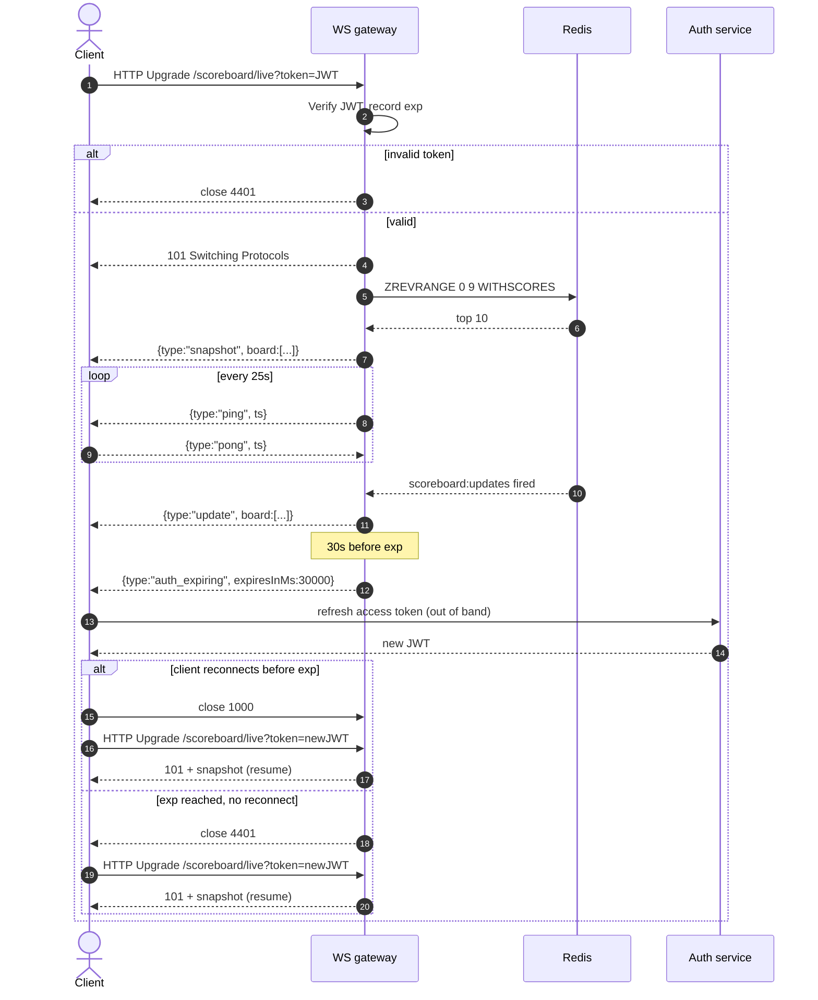

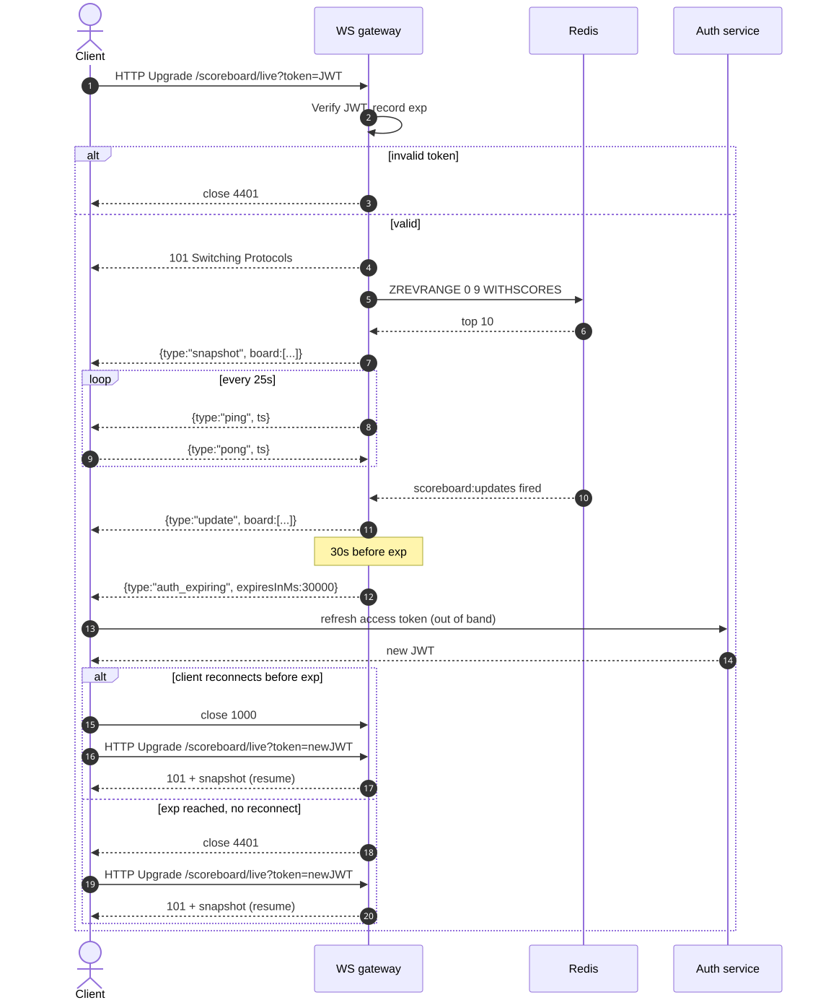

---

## 4. Anti-abuse decision tree

The increment endpoint is a chain of cheap gates. Each one rejects with a
deterministic HTTP status so clients can react predictably. The order is
chosen so the cheapest checks run first — a flood of bad requests never
reaches MySQL.

```mermaid
flowchart TD
    A[POST /scores/increment] --> B{User JWT valid?}
    B -- no --> B1[401 auth_required]
    B -- yes --> C{Idempotency-Key present?}
    C -- no --> C1[400 idempotency_required]
    C -- yes --> D{Action token<br/>signature valid?}
    D -- no --> D1[401 invalid_token]
    D -- yes --> E{exp present and<br/>still valid?}
    E -- expired --> E1[410 token_expired]
    E -- ok / absent --> F{token.sub == user.sub?}
    F -- no --> F1[403 token_user_mismatch]
    F -- yes --> G{1 ≤ token.delta ≤ MAX?}
    G -- no --> G1[400 validation_failed]
    G -- yes --> H{body.actionId matches<br/>token.act if present?}
    H -- no --> H1[400 action_mismatch]
    H -- yes --> I{Under rate limit?}
    I -- no --> I1[429 rate_limited]
    I -- yes --> J{SETNX redeemed:&#123;jti&#125;}
    J -- already set --> J1[200 + cached result]
    J -- first time --> K[Write tx + ZINCRBY + PUBLISH]
    K --> L[201 created]
```


---

## 5. Top-10 read path

Cache-aside pattern for the snapshot endpoint, with the MySQL fallback that
doubles as the cold-start path for a brand-new Redis instance. The
`scores(score DESC)` index makes the cold-start query cheap.

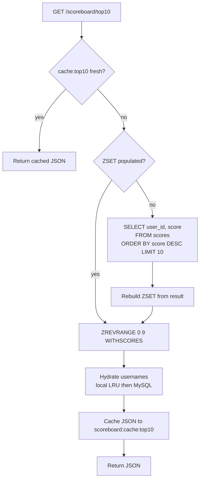


---

## 6. Write-path data flow (component view)

A condensed view of who owns which piece of state. Useful when reasoning
about consistency: **MySQL is the source of truth; Redis is a rebuildable
projection**. The dashed line is the nightly reconciliation job that heals
any drift introduced by failed dual writes.

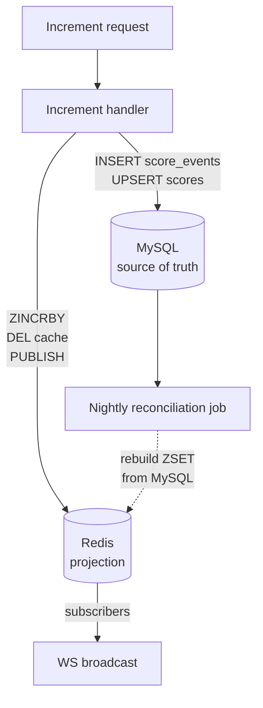


---

## 7. Anti-abuse — extended view (current + planned)

The v1 gates (top half) are documented in
[README.md §7](README.md). The bottom half shows the hardening
described in [IMPROVEMENTS.md §1 and §2](IMPROVEMENTS.md): server-issued
action tokens close the "synthetic completion" gap that idempotency alone
can't cover.

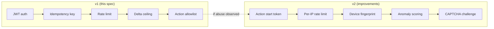


---

## 8. Observability dashboard sketch

What an on-call engineer should see at a glance. Mapped to the metric
catalogue in [README.md §11](README.md).

| Panel | Metric | Healthy range |
| --- | --- | --- |
| Increment throughput | `rate(increment_requests_total)` | Steady ± diurnal pattern |
| Accepted vs replayed vs rejected | `increment_requests_total{outcome=...}` | Rejected < 5 % |
| p50 / p95 / p99 latency | `histogram_quantile(increment_latency_seconds)` | p99 < 500 ms |
| Active WS connections | `ws_connections` | Matches expected MAU/connect rate |
| Rate-limit hits | `rate(ratelimit_hits_total)` | < 10 % of traffic |
| Redis publish failures | `rate(redis_publish_failures_total)` | 0 sustained |

---

## 9. Security checklist (for the implementing team)

These items belong on the team's pre-merge / pre-deploy checklist. See
[README.md §6, §7](README.md) for the rationale, and
[IMPROVEMENTS.md §3](IMPROVEMENTS.md) for the security hardening backlog.

- [ ] All endpoints served over HTTPS only; HSTS header set.
- [ ] JWT verified with an algorithm allowlist (`{ algorithms: ["HS256"] }`).
- [ ] `JWT_SECRET` loaded from a secrets manager, not from a committed
      `.env`.
- [ ] Token expiry ≤ 60 minutes; refresh flow lives in a separate module.
- [ ] CORS origin allowlist — no `*` in production.
- [ ] Input validation via `joi` / `zod` on every endpoint.
- [ ] Parameterised SQL queries everywhere — no string concatenation.
- [ ] Idempotency key required on all write endpoints (not just
      `/increment`).
- [ ] DB `UNIQUE(user_id, idempotency_key)` exists on `score_events` —
      Redis is not the only dedupe.
- [ ] `Idempotency-Key` is **hashed** before logging (raw keys are
      sensitive).
- [ ] Audit log retention policy documented (default: 90 days hot, 1 year
      cold).
- [ ] Dependency scan (`npm audit --omit=dev`) part of CI; high/critical
      blocks merge.
- [ ] Container image scanned (Trivy or equivalent).
- [ ] Penetration test booked before public launch.

---

## 10. Reviewers

This document should be reviewed by:

1. **Backend engineering** — implementability of every flow shown.
2. **Security** — anti-abuse decision tree §4 covers all known vectors.
3. **SRE / Infra** — the observability sketch §8 maps to existing
   dashboards.
4. **Product** — the lifecycle in §3 matches the intended user experience.

---
